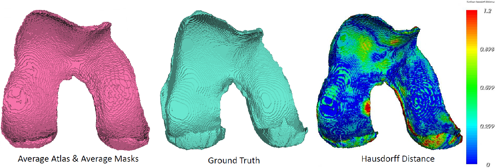

# :construction: Work in Progress :construction:

# Comprehensive Femoral Cartilage Segmentation via Atlas-Based Registration and UNet Deep Learning
## Utilizing 3T Sagittal DP Cube MR Imaging for Advanced Cartilage Analysis

In this thesis conducted at the Computational Bioengineering Laboratory of the Rizzoli Orthopaedic Institute in Bologna, two methods for femoral cartilage segmentation were implemented: one method leverages the creation of an Average Atlas as a reference within the pyKNEEr software ([Link pyKNEEr](https://sbonaretti.github.io/pyKNEEr/)), and the other employs a neural network UNet 2D developed using PyTorch.

- The registration-based method includes optimization phases for Elastix parameters and performance evaluation through cross-correlation of results; 

- The neural network approach involves an initial model training phase, validation of outcomes, followed by testing. The 2D segmentations obtained are then reconstructed into 3D volumes and post-processed for enhanced accuracy.

Subsequently, a statistical assessment can be performed using violin plots and Pearson correlation, while the average Hausdorff index is employed for spatial accuracy evaluation.

## Use of the Average Atlas
To utilize the Average Atlas as a new reference in the registration and segmentation of MRIs, it is necessary to first install the pyKNEEr software.

### Average Atlas creation 

The creation of the Average Atlas requires that the files to be used are pre-processed using pyKNEEr

Two types of Average Atlases can be generated:

- Average Atlas of the MRIs and binary masks of the femur and femoral cartilages of the patients;

- Average Atlas of the MRIs with segmentation of the femur and femoral cartilage performed directly from the average MRIs.

After creating the Average Atlas, it can be utilized within pyKNEEr in the *reference* folder as a new reference.

## Training, testing, and validation of the UNet neural network
For the training, validation, and testing of the 2D UNet neural network, the following percentages of their respective sets were used: training 66.66%, validation 25%, and testing 8.33%.
 

### Training

### Validation

### Testing

### 3D Volume Reconstruction & Post-processing

## Examples
The segmentation obtained in this comparison were achieved using pyKNEEr, utilizing the Average Atlas as the segmentation reference for the patients. The patients MRIs and binary masks were previously preprocessed using pyKNEEr [*Link repository pyKNEEr*](https://github.com/sbonaretti/pyKNEEr).

The segmentation achieved is reported, along with the ground truth segmented by an expert radiologist at the Rizzoli Orthopedic Institute in the Computational Bioengineering Laboratory (BIC), and the comparison using colorimetric maps of Hausdorff distances; the voxel spacing of the MRIs is 0.4121x0.4121x0.4000 mm. The average Hausdorff distance obtained is: __0.4225 mm__.

In this second comparison, the segmentation achieved using the 2D UNet neural network, adapted for the specific case of Sag DP Cube MRI images utilized in the BIC laboratory, is reported. Similar to the previous approach, images and binary masks were preprocessed using pyKNEEr before neural network training, validation, and testing were conducted.
In this instance as well, the voxel spacing of the MRIs is 0.4121x0.4121x0.4000 mm, while the average Hausdorff distance obtained is __0.2075 mm__.
 

## References
[1]  
__Paper__: Bonaretti S., Gold G., Beaupre G. pyKNEEr: [*An image analysis workflow for open and reproducible research on femoral knee cartilage*](https://journals.plos.org/plosone/article?id=10.1371/journal.pone.0226501) PLOS ONE 15(1): e0226501  
__Code__: Bonaretti S. pyKNEEr. Zenodo. 2019. 10.5281/zenodo.2574171 [*Link*](https://zenodo.org/records/7695948)  
__Data__: Dataset in (Bonaretti S. et al. 2019). Zenodo. 10.5281/zenodo.2583184 [*Link*](https://zenodo.org/records/2583184);

[2] __Paper__: Carballido-Gamio, J. [*Generation of an atlas of the proximal femur and its application to trabecular bone analysis*](https://pubmed.ncbi.nlm.nih.gov/21432904/);

[3] __Repository__: Persson, A. Machine Learning Collection. GitHub. 2023. [*Link*](https://github.com/aladdinpersson/Machine-Learning-Collection);

[4] __Paper__: Ronneberger, O., Fischer, P., & Brox, T. (2015). U-Net: Convolutional Networks for Biomedical Image Segmentation. arXiv:1505.04597v1. [*Link*](https://arxiv.org/abs/1505.04597);

[5] __Master's Thesis__: Chiumento, F. (2023/2024). Development, testing and evaluation of automatic methods for knee cartilage segmentation from Magnetic Resonance Images: application to a cohort of patients affected by medial knee osteoarthritis. Master's Thesis, Department of Information Engineering - DEI, University of Padua. [*Link*](https://hdl.handle.net/20.500.12608/62076).

